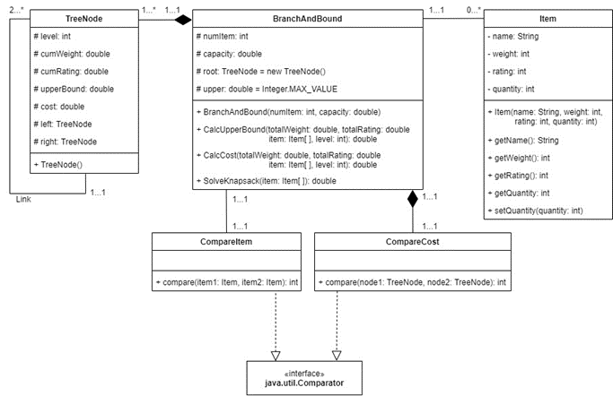
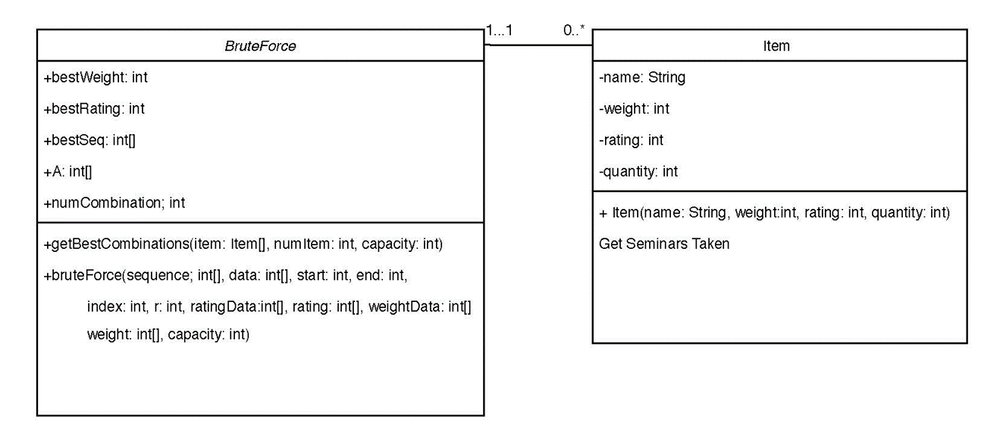
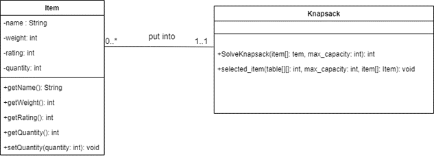
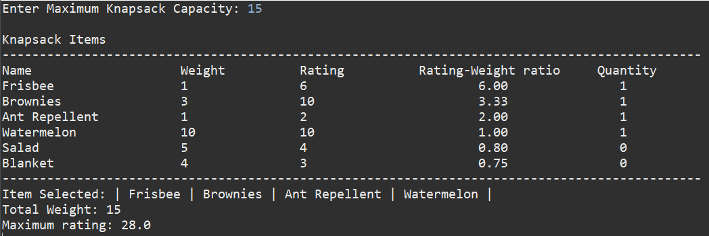
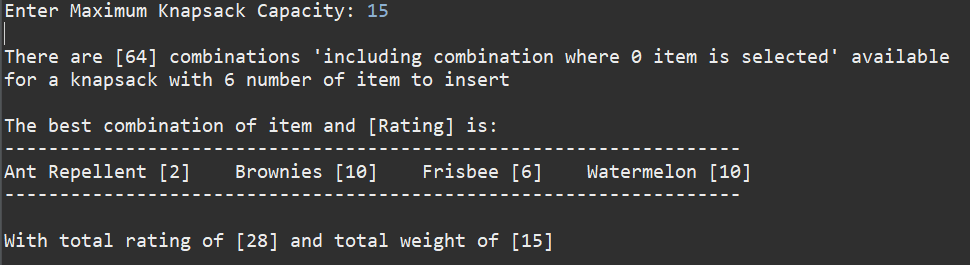
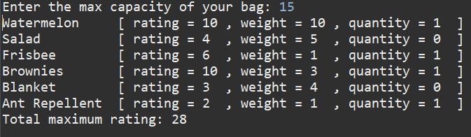

# KnapsackProblemSolving
<!-- ALL-CONTRIBUTORS-BADGE:START - Do not remove or modify this section -->

<!-- ALL-CONTRIBUTORS-BADGE:END -->

## Overview
This project contains three algorithms to solve 0-1 knapsack problems. The algorithm includes: 
1. Branch and Bound
2. Brute Force
3. Dynamic Programming

The problem is defined as follows:

We are planning for a picnic. There are some items we would like to carry. Our knapsack is only able to carry 15 pounds of items. The items are given with some ratings from 1 to 10 to indicates how strongly we want to include the particular item in knapsack for the picnic. Once the item is included in the knapsack, the same item cannot be carried again.

Items:
| Item          | Weight | Rating |
|---------------|--------|--------|
| Ant Repellent | 1      | 2      |
| Blanket       | 4      | 3      |
| Brownies      | 3      | 10     |
| Frisbee       | 1      | 6      |
| Salad         | 5      | 4      |
| Watermelon    | 10     | 10     |

## Tools
1. Java
2. Eclipse IDE

## Usage
Import the files into the project.  
Run the project with Java compiler.

## Application Design

### Class Diagram

#### Branch and Bound

#### Brute Force

#### Dynamic Programming

## Test
Manual testing has been performed.

## Previews
1. Branch and Bound     
2. Brute Force     
3. Dynamic Programming     

## Contributors
1. Lean Wei Liang (Dynamic Programming)
2. Seow Kai Sheng (Brute Force)
<!-- ALL-CONTRIBUTORS-LIST:START - Do not remove or modify this section -->
<!-- prettier-ignore-start -->
<!-- markdownlint-disable -->
<table>
  <tr>
    <td align="center"><a href="https://github.com/yuanjie8629"> <b>Tan Yuan Jie</b></a> <a href="https://github.com/yuanjie8629/Knapsack Problem Solving/commits?author=yuanjie8629" title="Code">💻</a> <a href="https://github.com/yuanjie8629/Knapsack Problem Solving/commits?author=yuanjie8629" title="Documentation">📖</a> <a href="#ideas-yuanjie8629" title="Ideas, Planning, & Feedback">🤔</a> <a href="#infra-yuanjie8629" title="Infrastructure (Hosting, Build-Tools, etc)">🚇</a> <a href="https://github.com/yuanjie8629/Knapsack Problem Solving/commits?author=yuanjie8629" title="Tests">⚠️</a></td>
    <td align="center"><a href="https://github.com/lwleo02"> <b>lwleo02</b></a> <a href="https://github.com/yuanjie8629/Knapsack Problem Solving/commits?author=lwleo02" title="Code">💻</a> <a href="https://github.com/yuanjie8629/Knapsack Problem Solving/commits?author=lwleo02" title="Documentation">📖</a> <a href="#ideas-lwleo02" title="Ideas, Planning, & Feedback">🤔</a> <a href="https://github.com/yuanjie8629/Knapsack Problem Solving/commits?author=lwleo02" title="Tests">⚠️</a></td>
    <td align="center"><a href="https://github.com/Kai411"> <b>kaii411</b></a> <a href="https://github.com/yuanjie8629/Knapsack Problem Solving/commits?author=Kai411" title="Code">💻</a> <a href="https://github.com/yuanjie8629/Knapsack Problem Solving/commits?author=Kai411" title="Documentation">📖</a> <a href="#ideas-Kai411" title="Ideas, Planning, & Feedback">🤔</a> <a href="https://github.com/yuanjie8629/Knapsack Problem Solving/commits?author=Kai411" title="Tests">⚠️</a></td>
  </tr>
</table>

<!-- markdownlint-restore -->
<!-- prettier-ignore-end -->

<!-- ALL-CONTRIBUTORS-LIST:END -->
3. Tan Yuan Jie (Branch and Bound)
